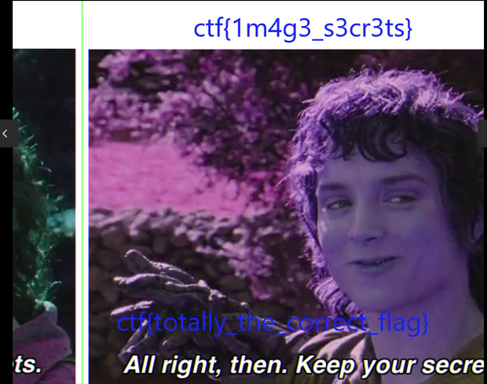

# SECRETS

We’re given **BxM_Foren3** file that we must do a forensic to find a flag

# Analysis

```bash
ExifTool Version Number         : 12.40
File Name                       : BxM_Foren3
Directory                       : .
File Size                       : 1247 KiB
File Modification Date/Time     : 2023:05:21 16:59:40+07:00
File Access Date/Time           : 2023:06:04 00:05:41+07:00
File Inode Change Date/Time     : 2023:06:01 17:47:07+07:00
File Permissions                : -rw-rw-r--
File Type                       : BMP
File Type Extension             : bmp
MIME Type                       : image/bmp
BMP Version                     : Unknown (44510)
Image Width                     : 710
Image Height                    : 500
Planes                          : 1
Bit Depth                       : 24
Compression                     : None
Image Length                    : 0
Pixels Per Meter X              : 3780
Pixels Per Meter Y              : 3780
Num Colors                      : Use BitDepth
Num Important Colors            : All
Red Mask                        : 0xffffffff
Green Mask                      : 0xffffffff
Blue Mask                       : 0xffffffff
Alpha Mask                      : 0xffffffff
Color Space                     : Unknown (����)
Rendering Intent                : Unknown (4294967295)
Image Size                      : 710x500
Megapixels                      : 0.355
```

The file is image/bmp with Unknown BMP version. maybe there’s wrong header value we check the value of the header using Bless


```bash
Header:     42 4D C2 7C 13 00 00 00 00 00 DE AD 00 00
DIB:	    DE AD 00 00 C6 02 00
Extra:      00 F4 01
```


DIB Header is incorrect here is of DIB header for Windows V5
**DE AD 00 00 C6 02 00**
and for Extra
**00 02 00**



**ctf{1m4g3_s3cr3ts}**
