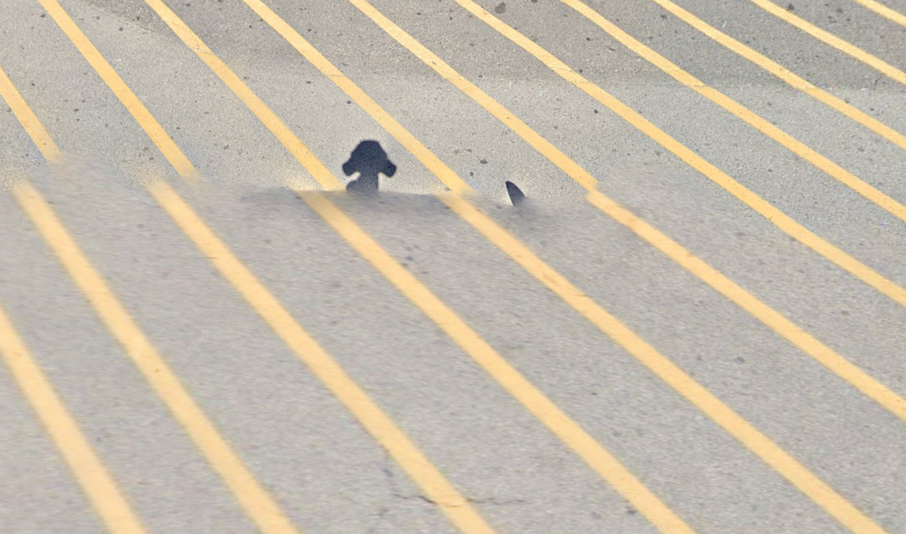
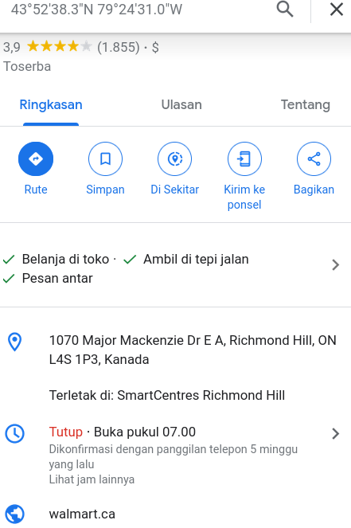

# Selfie

#### We are given a file named BxMCTF-Foren-2.png

# Brief

One day, clides was doing some detective work to try to catch the person who stole the 2 rubber duckies from the BxMCTF prize pool. He was doing some OSINT and he stumbled upon this street view image from ClaudsVille on Dread. Apparently, this image was sent from the thief.
Can you help clides to find out where the image was taken?
Submit the domain name of the company that owns the building as the flag, wrapped in **ctf{}**



# Analysis

```bash
ExifTool Version Number         : 12.40
File Name                       : BxMCTF-Foren-2.png
Directory                       : .
File Size                       : 1158 KiB
File Modification Date/Time     : 2023:05:21 16:56:04+07:00
File Access Date/Time           : 2023:06:02 11:28:34+07:00
File Inode Change Date/Time     : 2023:05:31 09:31:00+07:00
File Permissions                : -rwxrwxrwx
File Type                       : PNG
File Type Extension             : png
MIME Type                       : image/png
Image Width                     : 1203
Image Height                    : 709
Bit Depth                       : 8
Color Type                      : RGB with Alpha
Compression                     : Deflate/Inflate
Filter                          : Adaptive
Interlace                       : Noninterlaced
Exif Byte Order                 : Big-endian (Motorola, MM)
XMP Toolkit                     : Image::ExifTool 12.60
Latitude                        : 43 deg 52' 38.32" N
Longitude                       : 79 deg 24' 31.00" W
Image Size                      : 1203x709
Megapixels                      : 0.853
```

# Solution

The brief was clearly said **OSINT** and Submit the domain name of the company that owns the building as the flag, wrapped in **ctf{}**

We can do **OSINT** by searching the location based on

```python
Latitude                        : 43 deg 52' 38.32" N
Longitude                       : 79 deg 24' 31.00" W
```


The building owned by Walmart in canada
and the domain name is **walmart.ca**
**ctf{walmart.ca}**
